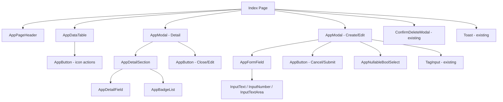

# Reusable Component Architecture Plan

## Overview

This document describes a set of reusable Blazor components to be added under `MafPlayground/Components/Shared/`, derived from repeating UI patterns observed in `ChatAgents/Index.razor` and `ChatClients/Index.razor`. The goal is to eliminate duplication, enforce consistency, and make future admin pages trivial to build.

---

## Identified Repeating Patterns

| Pattern | Found In |
|---|---|
| Page header: title + subtitle + primary action button | Both Index pages (lines 10-21) |
| Modal shell: `<dialog>`, `modal-box`, header row with close ×, footer action buttons, backdrop | Both Detail and Create/Edit modals |
| Detail field: label (uppercase, muted) + value (mono optional) | `DetailField()` helper duplicated identically in both pages |
| Detail section: titled group of fields with optional divider above | Multiple sections inside Detail modals |
| Form field wrapper: `form-control` + `label` + `label-text` + input + `ValidationMessage` | Every form input in both Create/Edit modals |
| Icon-only ghost action buttons (View / Edit / Delete) in table rows | Both Index pages (lines 61-78) |
| Primary submit button with spinner while saving | Both Create/Edit modal footers |
| Badge list: collection of `badge badge-outline` items (stop sequences) | ChatAgents detail modal (lines 153-162) |
| Loading / empty state for table body | Both Index pages (lines 26-86) |
| Nullable-bool `<select>` (Unset / True / False) | Both Create/Edit modals |

---

## Proposed Components

### Summary Table

| Component | File Path | Replaces |
|---|---|---|
| `AppPageHeader` | `Components/Shared/AppPageHeader.razor` | Inline page-header div in both Index pages |
| `AppModal` | `Components/Shared/AppModal.razor` | All `<dialog>` modal shells |
| `AppDetailField` | `Components/Shared/AppDetailField.razor` | `DetailField()` static helper in both pages |
| `AppDetailSection` | `Components/Shared/AppDetailSection.razor` | Titled groups within Detail modals |
| `AppFormField` | `Components/Shared/AppFormField.razor` | `form-control` + label wrappers in forms |
| `AppButton` | `Components/Shared/AppButton.razor` | All `<button class="btn ...">` usages |
| `AppBadgeList` | `Components/Shared/AppBadgeList.razor` | Stop-sequences badge rendering |
| `AppDataTable` | `Components/Shared/AppDataTable.razor` | Table card with loading/empty states |
| `AppNullableBoolSelect` | `Components/Shared/AppNullableBoolSelect.razor` | Nullable-bool select pattern |

---

## Component Specifications

---

### 1. `AppPageHeader`

**File:** `MafPlayground/Components/Shared/AppPageHeader.razor`

**Purpose:** Renders the standard page-header block: title, subtitle, and a right-aligned primary action button (or any slot content).

#### Parameters

| Parameter | Type | Required | Description |
|---|---|---|---|
| `Title` | `string` | ✅ | Main heading text (h1) |
| `Subtitle` | `string?` | ❌ | Optional muted subheading line |
| `ActionContent` | `RenderFragment?` | ❌ | Slot for the right-side action area (buttons, etc.) |

#### Example Usage

```razor
<AppPageHeader Title="Chat Agents"
               Subtitle="Manage AI agent configurations and behaviors">
    <ActionContent>
        <AppButton Variant="primary" Icon="plus" Class="w-full sm:w-auto"
                   OnClick="OpenCreateModal">
            New Agent
        </AppButton>
    </ActionContent>
</AppPageHeader>
```

#### Implementation Notes

```razor
<div class="flex flex-col sm:flex-row sm:items-center sm:justify-between gap-3 mb-6">
    <div>
        <h1 class="text-2xl font-bold">@Title</h1>
        @if (!string.IsNullOrEmpty(Subtitle))
        {
            <p class="text-sm opacity-60 mt-1">@Subtitle</p>
        }
    </div>
    @if (ActionContent is not null)
    {
        <div>@ActionContent</div>
    }
</div>
```

---

### 2. `AppModal`

**File:** `MafPlayground/Components/Shared/AppModal.razor`

**Purpose:** Provides the full DaisyUI modal shell: `<dialog>`, `modal-box` with configurable width, a standardised header row (title + optional subtitle + × close button), scrollable body slot, and footer slot. Handles backdrop close.

#### Parameters

| Parameter | Type | Required | Description |
|---|---|---|---|
| `IsOpen` | `bool` | ✅ | Controls `modal-open` CSS class |
| `Title` | `string` | ✅ | Bold heading inside the modal header |
| `Subtitle` | `string?` | ❌ | Optional muted subtext below title |
| `MaxWidth` | `string` | ❌ | Tailwind `max-w-*` class, default `max-w-3xl` |
| `OnClose` | `EventCallback` | ✅ | Called when × button or backdrop is clicked |
| `ChildContent` | `RenderFragment?` | ❌ | Body content of the modal |
| `FooterContent` | `RenderFragment?` | ❌ | Content placed inside `modal-action` footer |
| `ShowCloseButton` | `bool` | ❌ | Whether to show the × circle button, default `true` |

#### Example Usage — Detail Modal

```razor
<AppModal IsOpen="_isDetailModalOpen"
          Title="@_selectedAgent?.Id"
          Subtitle="@_selectedAgent?.Name"
          OnClose="CloseDetailModal">
    <ChildContent>
        <!-- detail sections here -->
    </ChildContent>
    <FooterContent>
        <AppButton Variant="ghost" OnClick="CloseDetailModal">Close</AppButton>
        <AppButton Variant="primary" Icon="edit"
                   OnClick="() => { CloseDetailModal(); OpenEditModal(_selectedAgent!); }">
            Edit
        </AppButton>
    </FooterContent>
</AppModal>
```

#### Example Usage — Create/Edit Modal

```razor
<AppModal IsOpen="_isModalOpen"
          Title="@(_isEditMode ? "Edit Chat Agent" : "New Chat Agent")"
          MaxWidth="max-w-3xl"
          OnClose="CloseModal">
    <ChildContent>
        <EditForm Model="_form" OnValidSubmit="SaveAgent">
            <DataAnnotationsValidator />
            <!-- fields -->
            <AppModal.Footer>  <!-- OR use FooterContent slot -->
                <AppButton Variant="ghost" Type="button" OnClick="CloseModal"
                           Disabled="_isSaving">Cancel</AppButton>
                <AppButton Variant="primary" Type="submit"
                           IsLoading="_isSaving" Disabled="_isSaving">
                    @(_isEditMode ? "Save Changes" : "Create")
                </AppButton>
            </AppModal.Footer>
        </EditForm>
    </ChildContent>
</AppModal>
```

#### Implementation Notes

```razor
<dialog class="modal @(IsOpen ? "modal-open" : "")">
    <div class="modal-box w-11/12 @MaxWidth max-h-[90vh] overflow-y-auto">
        @if (Title is not null)
        {
            <div class="flex items-start justify-between mb-4">
                <div>
                    <h3 class="font-bold text-lg">@Title</h3>
                    @if (!string.IsNullOrEmpty(Subtitle))
                    {
                        <p class="text-sm opacity-60 mt-0.5">@Subtitle</p>
                    }
                </div>
                @if (ShowCloseButton)
                {
                    <AppButton Variant="ghost" Size="sm" Circle OnClick="OnClose" Title="Close">
                        <!-- × SVG icon -->
                    </AppButton>
                }
            </div>
        }
        @ChildContent
        @if (FooterContent is not null)
        {
            <div class="modal-action mt-4">
                @FooterContent
            </div>
        }
    </div>
    <form method="dialog" class="modal-backdrop">
        <button type="button" @onclick="OnClose">close</button>
    </form>
</dialog>
```

---

### 3. `AppDetailField`

**File:** `MafPlayground/Components/Shared/AppDetailField.razor`

**Purpose:** Renders a single read-only label + value pair used throughout detail modals. Replaces the identical `DetailField()` static helper duplicated in both Index pages.

#### Parameters

| Parameter | Type | Required | Description |
|---|---|---|---|
| `Label` | `string` | ✅ | Uppercase muted label text |
| `Value` | `string?` | ❌ | Display value; renders `—` when null/empty |
| `Mono` | `bool` | ❌ | Apply `font-mono` to the value span, default `false` |

#### Example Usage

```razor
<AppDetailField Label="Model Id" Value="@agent.ModelId" Mono="true" />
<AppDetailField Label="Temperature" Value="@agent.Temperature?.ToString("F2")" />
```

#### Implementation Notes

```razor
<div class="flex flex-col gap-1">
    <span class="text-xs uppercase tracking-wide opacity-50 font-medium">@Label</span>
    <span class="text-sm @(Mono ? "font-mono" : "")">
        @(string.IsNullOrEmpty(Value) ? "—" : Value)
    </span>
</div>
```

---

### 4. `AppDetailSection`

**File:** `MafPlayground/Components/Shared/AppDetailSection.razor`

**Purpose:** A titled grouping block used inside detail modals to visually separate logical sections (e.g. "Identity", "Sampling Parameters"). Optionally prepends a `divider`.

#### Parameters

| Parameter | Type | Required | Description |
|---|---|---|---|
| `Title` | `string` | ✅ | Section heading text (rendered uppercase, muted) |
| `ShowDivider` | `bool` | ❌ | Render a `<div class="divider">` above the section, default `false` |
| `GridCols` | `string` | ❌ | Tailwind `grid-cols-*` override, default `grid-cols-1 sm:grid-cols-2` |
| `ChildContent` | `RenderFragment` | ✅ | The fields / content inside this section |

#### Example Usage

```razor
<AppDetailSection Title="Sampling Parameters" ShowDivider="true"
                  GridCols="grid-cols-2 sm:grid-cols-3 lg:grid-cols-4">
    <AppDetailField Label="Temperature" Value="@agent.Temperature?.ToString("F2")" />
    <AppDetailField Label="Max Output Tokens" Value="@agent.MaxOutputTokens?.ToString()" />
    <AppDetailField Label="Top P" Value="@agent.TopP?.ToString("F3")" />
</AppDetailSection>
```

#### Implementation Notes

```razor
@if (ShowDivider)
{
    <div class="divider my-2"></div>
}
<div class="mb-5">
    <h4 class="text-xs uppercase tracking-widest opacity-50 font-semibold mb-3">@Title</h4>
    <div class="grid @GridCols gap-3">
        @ChildContent
    </div>
</div>
```

> **Note:** When section content does not fit a grid (e.g. a `<pre>` block or badge list), `ChildContent` can include its own layout. The `GridCols` parameter is only applied when the section wrapper `<div class="grid ...">` is used; alternatively the implementor can skip the grid by passing `GridCols=""`.

---

### 5. `AppFormField`

**File:** `MafPlayground/Components/Shared/AppFormField.razor`

**Purpose:** Wraps a form input in a DaisyUI `form-control` with a standardised label. Accepts the label text and an optional required-asterisk flag plus a hint string; renders `ChildContent` for the actual `<InputText>`, `<InputNumber>`, `<select>` etc.

#### Parameters

| Parameter | Type | Required | Description |
|---|---|---|---|
| `Label` | `string` | ✅ | Label text displayed inside `label-text` |
| `Required` | `bool` | ❌ | Appends a red `*` to the label, default `false` |
| `Hint` | `string?` | ❌ | Optional muted hint appended to label (e.g. "(0–2)") |
| `ColSpan` | `string` | ❌ | Additional `col-span-*` class for grid layout, default `""` |
| `ChildContent` | `RenderFragment` | ✅ | The input element(s) and ValidationMessage |

#### Example Usage

```razor
<AppFormField Label="Id" Required="true" ColSpan="md:col-span-1">
    <InputText class="input input-bordered" @bind-Value="_form.Id"
               disabled="@_isEditMode" placeholder="e.g. Default" />
    <ValidationMessage For="() => _form.Id" class="text-error text-xs mt-1" />
</AppFormField>

<AppFormField Label="Temperature" Hint="(0–2)">
    <InputNumber class="input input-bordered" @bind-Value="_form.Temperature"
                 step="0.1" placeholder="1.0" />
    <ValidationMessage For="() => _form.Temperature" class="text-error text-xs mt-1" />
</AppFormField>
```

#### Implementation Notes

```razor
<div class="form-control @ColSpan">
    <label class="label">
        <span class="label-text font-medium">
            @Label
            @if (Required)
            {
                <span class="text-error"> *</span>
            }
            @if (!string.IsNullOrEmpty(Hint))
            {
                <span class="opacity-50 text-xs"> @Hint</span>
            }
        </span>
    </label>
    @ChildContent
</div>
```

---

### 6. `AppButton`

**File:** `MafPlayground/Components/Shared/AppButton.razor`

**Purpose:** Unified button component supporting all DaisyUI button variants, sizes, loading spinner state, disabled state, icon-only (circle) mode, and optional pre-defined SVG icons (via an enum/string). Eliminates the dozens of inline `<button class="btn ...">` with embedded SVGs.

#### Parameters

| Parameter | Type | Required | Description |
|---|---|---|---|
| `Variant` | `string` | ❌ | DaisyUI variant: `primary`, `secondary`, `ghost`, `error`, `outline`, `neutral`. Default `""` |
| `Size` | `string` | ❌ | `xs`, `sm`, `md` (default), `lg` |
| `Type` | `string` | ❌ | HTML button type: `button` (default), `submit`, `reset` |
| `Icon` | `string?` | ❌ | Named icon to render: `plus`, `edit`, `delete`, `view`, `close`. Renders inline SVG |
| `Circle` | `bool` | ❌ | Adds `btn-circle` for icon-only round buttons, default `false` |
| `IsLoading` | `bool` | ❌ | Shows `loading loading-spinner` inside button when `true` |
| `Disabled` | `bool` | ❌ | Disables the button |
| `Title` | `string?` | ❌ | HTML `title` tooltip attribute |
| `Class` | `string?` | ❌ | Additional CSS classes appended to `btn ...` |
| `OnClick` | `EventCallback` | ❌ | Click handler |
| `ChildContent` | `RenderFragment?` | ❌ | Button label text/content (omit for icon-only) |

#### Icon Name → SVG Map

| Name | SVG |
|---|---|
| `plus` | `M12 4v16m8-8H4` |
| `edit` | Pencil path (edit icon) |
| `delete` | Trash icon path |
| `view` | Eye icon path |
| `close` | `M6 18L18 6M6 6l12 12` |

#### Example Usage

```razor
<!-- Primary action button -->
<AppButton Variant="primary" Icon="plus" Class="w-full sm:w-auto"
           OnClick="OpenCreateModal">
    New Agent
</AppButton>

<!-- Icon-only table action buttons -->
<AppButton Variant="ghost" Size="xs" Icon="view" Title="View"
           OnClick="() => OpenDetailModal(agent)" />
<AppButton Variant="ghost" Size="xs" Icon="edit" Title="Edit"
           OnClick="() => OpenEditModal(agent)" />
<AppButton Variant="ghost" Size="xs" Icon="delete" Title="Delete"
           Class="text-error" OnClick="() => OpenDeleteModal(agent)" />

<!-- Submit with loading state -->
<AppButton Variant="primary" Type="submit"
           IsLoading="_isSaving" Disabled="_isSaving">
    @(_isEditMode ? "Save Changes" : "Create")
</AppButton>

<!-- Ghost cancel -->
<AppButton Variant="ghost" Type="button" Disabled="_isSaving"
           OnClick="CloseModal">
    Cancel
</AppButton>

<!-- Close circle button -->
<AppButton Variant="ghost" Size="sm" Circle Icon="close"
           Title="Close" OnClick="CloseDetailModal" />
```

#### Implementation Notes

```razor
@{
    var cssClass = $"btn {VariantClass} {SizeClass} {(Circle ? "btn-circle" : "")} {Class}".Trim();
}
<button type="@Type" class="@cssClass" disabled="@Disabled" title="@Title"
        @onclick="OnClick">
    @if (IsLoading)
    {
        <span class="loading loading-spinner loading-sm"></span>
    }
    @if (!string.IsNullOrEmpty(Icon))
    {
        @RenderIcon(Icon)
    }
    @ChildContent
</button>
```

Where `VariantClass` maps `Variant` → `btn-primary`, `btn-ghost`, etc., and `SizeClass` maps `Size` → `btn-xs`, `btn-sm`, etc.

---

### 7. `AppBadgeList`

**File:** `MafPlayground/Components/Shared/AppBadgeList.razor`

**Purpose:** Renders a list of string values as DaisyUI `badge badge-outline` pills. Used for stop sequences and any other tag/keyword collections in read-only detail views.

#### Parameters

| Parameter | Type | Required | Description |
|---|---|---|---|
| `Items` | `IEnumerable<string>` | ✅ | The collection of strings to display as badges |
| `Variant` | `string` | ❌ | Badge variant class suffix, default `outline`. Options: `outline`, `primary`, `secondary`, `ghost` |
| `Mono` | `bool` | ❌ | Apply `font-mono` to badge text, default `false` |

#### Example Usage

```razor
@if (_selectedAgent.StopSequences is { Count: > 0 })
{
    <AppDetailSection Title="Stop Sequences" ShowDivider="false">
        <AppBadgeList Items="_selectedAgent.StopSequences" Mono="true" />
    </AppDetailSection>
}
```

#### Implementation Notes

```razor
<div class="flex flex-wrap gap-2 mt-2">
    @foreach (var item in Items)
    {
        <span class="badge badge-@Variant @(Mono ? "font-mono" : "")">@item</span>
    }
</div>
```

---

### 8. `AppDataTable`

**File:** `MafPlayground/Components/Shared/AppDataTable.razor`

**Purpose:** Wraps a DaisyUI card around a `<table class="table table-zebra">` and handles three states: loading spinner, empty state message, and the actual table. The caller provides column headers and row content via slots.

#### Parameters

| Parameter | Type | Required | Description |
|---|---|---|---|
| `IsLoading` | `bool` | ✅ | Shows centered loading spinner when `true` |
| `IsEmpty` | `bool` | ✅ | Shows empty-state message when `true` and not loading |
| `EmptyTitle` | `string` | ❌ | Primary empty-state message, default `"No items found."` |
| `EmptySubtitle` | `string?` | ❌ | Secondary hint below empty title |
| `HeaderContent` | `RenderFragment` | ✅ | `<tr>` element(s) for `<thead>` |
| `BodyContent` | `RenderFragment` | ✅ | `<tr>` element(s) for `<tbody>` |

#### Example Usage

```razor
<AppDataTable IsLoading="_isLoading"
              IsEmpty="@(_agents.Count == 0)"
              EmptyTitle="No chat agents found."
              EmptySubtitle='Click "New Agent" to create one.'>
    <HeaderContent>
        <tr>
            <th>Id</th>
            <th>Name</th>
            <th>Model Id</th>
            <th>Description</th>
            <th>Actions</th>
        </tr>
    </HeaderContent>
    <BodyContent>
        @foreach (var agent in _agents)
        {
            <tr>
                <td class="font-mono font-semibold">@agent.Id</td>
                <td>@(agent.Name ?? "—")</td>
                <td class="font-mono text-sm">@(agent.ModelId ?? "—")</td>
                <td class="max-w-xs truncate opacity-70">@(agent.Description ?? "—")</td>
                <td>
                    <div class="flex gap-1">
                        <AppButton Variant="ghost" Size="xs" Icon="view" Title="View"
                                   OnClick="() => OpenDetailModal(agent)" />
                        <AppButton Variant="ghost" Size="xs" Icon="edit" Title="Edit"
                                   OnClick="() => OpenEditModal(agent)" />
                        <AppButton Variant="ghost" Size="xs" Icon="delete" Title="Delete"
                                   Class="text-error" OnClick="() => OpenDeleteModal(agent)" />
                    </div>
                </td>
            </tr>
        }
    </BodyContent>
</AppDataTable>
```

#### Implementation Notes

```razor
<div class="card bg-base-100 shadow-sm">
    <div class="card-body p-0">
        @if (IsLoading)
        {
            <div class="flex justify-center items-center py-16">
                <span class="loading loading-spinner loading-lg"></span>
            </div>
        }
        else if (IsEmpty)
        {
            <div class="text-center py-16 opacity-50">
                <p class="text-lg">@EmptyTitle</p>
                @if (!string.IsNullOrEmpty(EmptySubtitle))
                {
                    <p class="text-sm mt-1">@EmptySubtitle</p>
                }
            </div>
        }
        else
        {
            <div class="overflow-x-auto">
                <table class="table table-zebra">
                    <thead>@HeaderContent</thead>
                    <tbody>@BodyContent</tbody>
                </table>
            </div>
        }
    </div>
</div>
```

---

### 9. `AppNullableBoolSelect`

**File:** `MafPlayground/Components/Shared/AppNullableBoolSelect.razor`

**Purpose:** A DaisyUI `select select-bordered` for three-state boolean fields (Unset / True / False). Replaces the duplicated `<select>` + `NullableBoolToString` / `StringToNullableBool` helper pattern.

#### Parameters

| Parameter | Type | Required | Description |
|---|---|---|---|
| `Value` | `bool?` | ✅ | Current value |
| `ValueChanged` | `EventCallback<bool?>` | ✅ | Two-way binding callback |
| `UnsetLabel` | `string` | ❌ | Label for the null option, default `"— Unset —"` |

#### Example Usage

```razor
<AppFormField Label="Allow Multiple Tool Calls">
    <AppNullableBoolSelect @bind-Value="_form.AllowMultipleToolCalls" />
</AppFormField>

<AppFormField Label="Enable Distributed Tracing">
    <AppNullableBoolSelect @bind-Value="_form.EnableDistributedTracing" />
</AppFormField>
```

#### Implementation Notes

```razor
<select class="select select-bordered"
        value="@ToString(Value)"
        @onchange="e => ValueChanged.InvokeAsync(Parse(e.Value?.ToString()))">
    <option value="">@UnsetLabel</option>
    <option value="true">True</option>
    <option value="false">False</option>
</select>

@code {
    [Parameter] public bool? Value { get; set; }
    [Parameter] public EventCallback<bool?> ValueChanged { get; set; }
    [Parameter] public string UnsetLabel { get; set; } = "— Unset —";

    private static string ToString(bool? v) => v switch { true => "true", false => "false", _ => "" };
    private static bool? Parse(string? v) => v switch { "true" => true, "false" => false, _ => null };
}
```

---

## Architecture Diagram



---

## Migration Notes

### `ChatAgents/Index.razor`

| Current Code | Replace With |
|---|---|
| Lines 10–21: page header div | `<AppPageHeader Title="Chat Agents" Subtitle="..." >` with `AppButton` in `ActionContent` |
| Lines 24–87: card with table loading/empty/data | `<AppDataTable IsLoading="..." IsEmpty="..." ...>` |
| Lines 62–77: inline btn btn-xs btn-ghost buttons | `<AppButton Variant="ghost" Size="xs" Icon="view/edit/delete" .../>` |
| Lines 90–190: Detail `<dialog>` shell | `<AppModal IsOpen="..." Title="..." OnClose="...">` |
| Lines 111–163: section dividers + h4 + grid | `<AppDetailSection Title="..." ShowDivider="true" GridCols="...">` |
| Lines 113–117, 132–138, 148–149: `@DetailField(...)` calls | `<AppDetailField Label="..." Value="..." Mono="true/false" />` |
| Lines 153–162: stop sequences badge display | `<AppBadgeList Items="..." Mono="true" />` |
| Lines 176–183: `modal-action` buttons | `AppButton` in `FooterContent` slot of `AppModal` |
| Lines 193–328: Create/Edit `<dialog>` shell | `<AppModal IsOpen="..." ...>` |
| Lines 202–310: each `form-control` div | `<AppFormField Label="..." Required="..." Hint="...">` |
| Lines 275–292: nullable bool selects | `<AppNullableBoolSelect @bind-Value="..." />` |
| Lines 313–322: modal-action footer | `FooterContent` slot in `AppModal` with `AppButton` |
| Lines 472–485: static `DetailField()` helper | **Delete** — replaced by `AppDetailField` component |
| Lines 487–499: `NullableBoolToString` / `StringToNullableBool` helpers | **Delete** — moved into `AppNullableBoolSelect` |

### `ChatClients/Index.razor`

| Current Code | Replace With |
|---|---|
| Lines 10–21: page header div | `<AppPageHeader Title="Chat Clients" Subtitle="..." >` |
| Lines 24–87: card with table | `<AppDataTable ...>` |
| Lines 62–77: action buttons | `<AppButton Variant="ghost" Size="xs" Icon="..." .../>` |
| Lines 90–157: Detail `<dialog>` | `<AppModal ...>` |
| Lines 110–141: detail sections | `<AppDetailSection ...>` with `<AppDetailField .../>` |
| Lines 143–151: modal footer | `FooterContent` slot |
| Lines 160–255: Create/Edit `<dialog>` | `<AppModal ...>` |
| Lines 169–236: form-control divs | `<AppFormField ...>` |
| Lines 225–231: nullable bool select | `<AppNullableBoolSelect @bind-Value="..." />` |
| Lines 240–249: modal-action footer | `FooterContent` slot with `AppButton` |
| Lines 396–409: static `DetailField()` helper | **Delete** |
| Lines 411–423: bool helpers | **Delete** |

---

## Files to Create

```
MafPlayground/Components/Shared/AppButton.razor
MafPlayground/Components/Shared/AppModal.razor
MafPlayground/Components/Shared/AppDetailField.razor
MafPlayground/Components/Shared/AppDetailSection.razor
MafPlayground/Components/Shared/AppFormField.razor
MafPlayground/Components/Shared/AppBadgeList.razor
MafPlayground/Components/Shared/AppDataTable.razor
MafPlayground/Components/Shared/AppNullableBoolSelect.razor
```

## Files to Modify

```
MafPlayground/Components/Pages/Admin/ChatAgents/Index.razor   — refactor using new components
MafPlayground/Components/Pages/Admin/ChatClients/Index.razor  — refactor using new components
```

## Files Unchanged

```
MafPlayground/Components/Shared/ConfirmDeleteModal.razor  — keep as-is (already encapsulated)
MafPlayground/Components/Shared/TagInput.razor            — keep as-is (already encapsulated)
MafPlayground/Components/Shared/Toast.razor               — keep as-is (already encapsulated)
MafPlayground/Components/_Imports.razor                   — no changes needed (already imports Shared namespace)
```

---

## Implementation Order (suggested for Code mode)

1. `AppButton` — used everywhere, no dependencies on other new components
2. `AppDetailField` — simple, no dependencies
3. `AppBadgeList` — simple, no dependencies
4. `AppNullableBoolSelect` — simple, no dependencies
5. `AppFormField` — depends only on existing Blazor `EditForm` infrastructure
6. `AppDetailSection` — depends on `AppDetailField` (used inside it)
7. `AppModal` — depends on `AppButton` (close button)
8. `AppPageHeader` — depends on `AppButton` (action slot)
9. `AppDataTable` — depends on `AppButton` (used in rows)
10. Refactor `ChatAgents/Index.razor` — uses all new components
11. Refactor `ChatClients/Index.razor` — uses all new components
